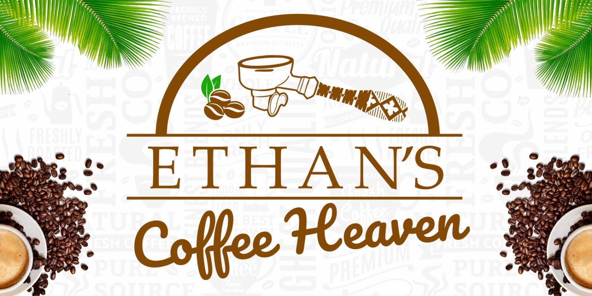

# Ethan's Coffee Heaven

This is the repository for the Cafe [Ethan's Coffee Heaven](https://www.ethanscoffeeheaven.com). A small catering business in Fiji.

## Overview

This is a static site to promote the cafe business. It contains a call to action to make a booking, the menus, social media content and links to get directions.

It is hosted here with GitHub Pages and the domain name was purchased from Google Domains.

### Ethan's Coffee Heaven

Ethan's Coffee Heaven is a cafe business with two locations in northern Fiji, one in Labasa and the other in Savusavu.

Labasa [Facebook page](https://www.facebook.com/ethanscoffee/)

Savusavu [Facebook page](https://www.facebook.com/profile.php?id=100064196137922)

[Instagram page](https://www.instagram.com/ethanscoffeeheaven/) for both sites.

#### Resources

Photos and content provided by Ethan's Coffee Heaven's social media or directly from staff.

Booking button style adapted from Button 90 on [CSS Scan](https://getcssscan.com/css-buttons-examples).

Color gradients and text shadwows generated with [htm-css-js.com](https://html-css-js.com/).

Drop shadow used on background images informed by [CSS { In Real Life }](https://css-irl.info/drop-shadow-the-underrated-css-filter/)

Menus created using [Canva](https://www.canva.com/)

Menu collage created with [befunky.com](https://www.befunky.com/create/collage/).

Favicon [Coffee cup](https://icons8.com/icon/35901/coffee) from [Icons8](https://icons8.com).

Fonts from [Google Fonts](https://developers.google.com/fonts).

Menu, schedule, location, navigation and phone icons from [Google Icons](https://fonts.google.com/icons)

Footer social icons from [Font Awesome](https://fontawesome.com/)
